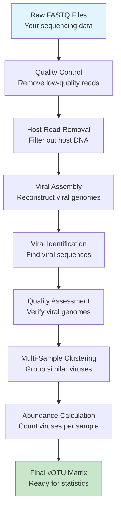

# **Viro-Flow (viral-discovery-pipeline): A Viral Metagenomics Discovery Pipeline**


**A robust and automated bioinformatics pipeline for the identification and analysis of viral sequences from raw metagenomic sequencing data**

---

## 🚀 **Quick Start Options**

### **Option 1: Modern Python CLI (Recommended for Developers)**
```bash
pip install -e .
viral-pipeline --help
viral-pipeline init --output-path config.yaml
viral-pipeline config --validate --config-path config.yaml
viral-pipeline run --input-dir data/ --output-dir outputs/
```

### **Option 2: Traditional Bash Scripts (Recommended for Academic Users)**
```bash
# Install dependencies with conda
conda create -n viroflow -c conda-forge -c bioconda fastp bwa samtools megahit virsorter2 genomad checkv bowtie2 coverm
conda activate viroflow

# Process samples
./viral_pipeline.sh -s Sample1 -1 data/Sample1_R1.fastq.gz -2 data/Sample1_R2.fastq.gz
./combine_and_analyze.sh -i sample_outputs/ -o final_results/
```

---

## 📚 **Documentation Structure**

This repository contains two documentation approaches:

### **For Academic Researchers (This README)**
- Complete beginner-friendly guide below
- Step-by-step installation instructions
- Troubleshooting and examples
- Focus on bash script usage

### **For Developers (See `docs/` folder)**
- MkDocs user guides live in `docs/`
- Sphinx API documentation lives in `docs/api/`
- Container recipes: `Dockerfile`, `docker-compose.yml`, `Singularity.def`
- Modern Python CLI with typed configuration

---

## 🛠️ **Development Setup**

```bash
python -m venv .venv
source .venv/bin/activate
pip install -e .[all]
pytest
```

---

## **🎯 Executive Summary**

**Ideal for**: Researchers studying viromes from environmental samples, clinical samples, or model organisms  
**Input**: Raw metagenomic sequencing data (Illumina paired-end or single-end FASTQ files)  
**Output**: Viral operational taxonomic units (vOTUs) with abundance matrices ready for statistical analysis  
**Typical runtime**: 4-24 hours per sample (depending on data size and computing resources)  
**Success rate**: >95% for well-prepared metagenomic datasets  

### **What Viro-Flow Does in Biological Terms**

Viro-Flow transforms your raw sequencing data into a complete viral community profile:



### **Methodology & Algorithms**

Viro-Flow employs scientifically validated methods commonly used in high-impact viromics publications (e.g., *Nature*, *Cell*).

#### **Viral Abundance Calculation (TPM)**
To ensure comparable results across samples, we use **Transcripts Per Million (TPM)** normalization:

1.  **Dereplication**: Redundant viral contigs are removed using **CD-HIT-EST** (99% identity, 90% coverage) to create a non-redundant catalog.
2.  **vOTU Clustering**: Contigs are grouped into Viral Operational Taxonomic Units (vOTUs) at species level using **FastANI** (95% ANI, 85% coverage).
3.  **Read Mapping**: Quality-controlled reads from each sample are mapped back to the vOTU catalog using **Bowtie2** (very-sensitive mode).
4.  **Abundance Estimation**: **CoverM** calculates TPM, adjusting for gene length and sequencing depth. This metric represents the relative abundance of each virus in the community.

---

## **✅ Before You Begin: Essential Checklist**

### **Computing Requirements**
- [ ] **Operating System**: Linux (Ubuntu 18.04+ or CentOS 7+) or macOS 10.15+
- [ ] **Memory**: Minimum 16GB RAM (32GB+ recommended for large datasets)
- [ ] **Storage**: 100GB+ free space (10x your input data size)
- [ ] **Processor**: 4+ CPU cores (8+ recommended for faster processing)

### **Software Prerequisites**
- [ ] **Terminal/Command Line Access**: Ability to open and use terminal
- [ ] **Internet Connection**: For downloading databases and tools
- [ ] **Admin/Sudo Access**: For installing some dependencies (check with IT)

### **Data Requirements**
- [ ] **Sequencing Data**: FASTQ format files (paired-end recommended)
- [ ] **File Names**: No spaces in file names (use underscores instead)
- [ ] **Data Quality**: Minimum Q30+ scores (check your sequencing report)

### **Biological Information**
- [ ] **Host Genome**: Reference genome for host removal (human, plant, etc.)
- [ ] **Sample Metadata**: Sample names, conditions, collection details

---

## **🖥️ HPC & Cluster Usage**

Running on a university or institute cluster? We have specific guides for:
- **Singularity / Apptainer** (Recommended)
- **Slurm / PBS** Job submission
- **Conda** on HPC

👉 **[Read the HPC User Guide](./docs/hpc_guide.md)**

---

## **📦 Step-by-Step Installation Guide**

### **What is Conda?**
Conda is a package manager that handles software installations and prevents conflicts between different bioinformatics tools. Think of it as an app store specifically for scientific software.

### **Method 1: Conda (Recommended for Most Users)**

#### **Step 1: Install Miniconda**

```bash
# Download Miniconda (Linux)
wget https://repo.anaconda.com/miniconda/Miniconda3-latest-Linux-x86_64.sh
bash Miniconda3-latest-Linux-x86_64.sh

# Follow the prompts. Say "yes" to initializing conda
# Restart your terminal after installation
```

#### **Step 2: Create Viro-Flow Environment**

```bash
# This creates an isolated space for our tools
conda create -n viroflow -c conda-forge -c bioconda \
    fastp bwa samtools bedtools \
    spades megahit seqkit python=3.8 \
    virsorter2 'dvf-py=1.0' genomad checkv \
    fastani bowtie2 coverm

# Activate the environment (do this every time you use Viro-Flow)
conda activate viroflow
```

**Expected Output**: You should see `(viroflow)` at the beginning of your terminal prompt.

#### **Step 3: Verify Installation**

```bash
# Test that tools are working
fastp --version
bwa
samtools

# If you see version/help messages, installation was successful
```

### **Common Installation Issues**

| Problem | Common Cause | Solution |
|---------|--------------|----------|
| `conda: command not found` | Conda not installed or not in PATH | Close and reopen terminal, or restart computer |
| Permission denied errors | No admin rights | Contact IT department about sudo/admin access |
| Package not found | Conda channels incorrect | Make sure to include `-c conda-forge -c bioconda` |

---

## **📁 Preparing Your Sequencing Data**

### **File Format Requirements**
- **Format**: FASTQ files compressed with gzip (.fastq.gz)
- **Encoding**: Standard Sanger/Illumina (Phred+33)
- **File Naming**: No spaces, use underscores or hyphens

### **Example Good Names:**
✅ `Sample1_R1.fastq.gz`  
✅ `Treatment_Control_Replicate2_R1.fastq.gz`  
✅ `River_Sample_Jan2023_R1.fastq.gz`

### **Example Bad Names (Don't Use):**
❌ `Sample 1 reads R1.fastq.gz` (contains spaces)  
❌ `data_from_March_2023.txt` (wrong extension)  
❌ `sample1.fasta` (wrong format)

### **How to Check Your Data**

```bash
# View first few lines of your data
zless your_file.fastq.gz | head

# Basic quality check (if you have fastqc)
fastqc your_file.fastq.gz
```

### **Expected File Sizes by Sequencing Type:**

| Sequencing Type | Typical Size per Sample | Recommended Depth |
|-----------------|-------------------------|-------------------|
| Illumina 2x150 bp | 5-20 GB | 10-30 million reads |
| Illumina 2x250 bp | 8-30 GB | 5-20 million reads |

---

## **🚀 Running Viro-Flow: Step-by-Step Guide**

### **Overview of the Pipeline**

Viro-Flow has two main stages:
1. **Stage 1**: Process each sample individually (`viral_pipeline.sh`)
2. **Stage 2**: Combine all samples for comparison (`combine_and_analyze.sh`)

### **Stage 1: Processing Individual Samples**

#### **Understanding the Command**

```bash
./viral_pipeline.sh -s Sample1 -1 data/Sample1_R1.fastq.gz -2 data/Sample1_R2.fastq.gz
```

**Breaking it down:**
- `-s Sample1`: Unique identifier for your sample
- `-1 data/Sample1_R1.fastq.gz`: Forward reads file (R1)
- `-2 data/Sample1_R2.fastq.gz`: Reverse reads file (R2)

#### **Processing Multiple Samples**

```bash
# Process each sample individually
./viral_pipeline.sh -s Control1 -1 data/Control1_R1.fastq.gz -2 data/Control1_R2.fastq.gz
./viral_pipeline.sh -s Control2 -1 data/Control2_R1.fastq.gz -2 data/Control2_R2.fastq.gz
./viral_pipeline.sh -s Treatment1 -1 data/Treatment1_R1.fastq.gz -2 data/Treatment1_R2.fastq.gz
./viral_pipeline.sh -s Treatment2 -1 data/Treatment2_R1.fastq.gz -2 data/Treatment2_R2.fastq.gz
```

#### **What Happens During Processing?**

| Step | Biological Purpose | Typical Time | What to Watch For |
|------|-------------------|--------------|-------------------|
| **Quality Control** | Remove low-quality sequences and adapters | 5-15 minutes | "Quality control completed" |
| **Host Removal** | Filter out host DNA to focus on viruses | 30-60 minutes | "Host removal complete" |
| **Viral Assembly** | Reconstruct viral genomes from short reads | 1-4 hours | "Assembly complete" |
| **Viral Identification** | Distinguish viral from bacterial sequences | 30-60 minutes | "Viral identification complete" |
| **Quality Assessment** | Final quality checks on viral genomes | 15-30 minutes | "CheckV analysis complete" |

#### **Monitoring Progress**

The pipeline provides real-time updates:

```bash
[2024-01-15 14:30:22] - Starting quality control for Sample1...
[2024-01-15 14:45:18] - Quality control completed
[2024-01-15 14:45:20] - Starting host read removal...
[2024-01-15 14:50:15] - Host removal complete. Non-host reads are in Sample1_analysis/02_rmhost
[2024-01-15 14:50:17] - Assembling and Filtering Contigs...
[2024-01-15 15:30:22] - Assembly complete. Filtered contigs are in Sample1_analysis/03_assembly
[2024-01-15 15:30:24] - Identifying and Filtering Viral Sequences...
[2024-01-15 16:45:30] - Viral identification complete.
[2024-01-15 16:45:32] - Viro-Flow Stage 1 Finished for Sample: Sample1
```

#### **Expected Output Structure**

```
Sample1_analysis/
├── 01_qc/
│   ├── fastp/
│   │   ├── fastp_1.fastq.gz
│   │   └── fastp_2.fastq.gz
│   └── Sample1.fastp.html
├── 02_rmhost/
│   ├── rmhost_1.fastq.gz
│   └── rmhost_2.fastq.gz
├── 03_assembly/
│   ├── assembly.fa
│   ├── contigs_filtered.fa
│   └── assembly_stats.txt
├── 04_viral_id/
│   ├── combined_viral_cdhit99.fa
│   ├── dvf/
│   ├── vs2/
│   └── genomad/
├── 05_checkv/
│   ├── high_quality_viral.fa
│   └── quality_summary.tsv
└── Sample1_final_viruses.fna  <-- YOUR MAIN RESULT
```

#### **Single-End Data Processing**

If you only have single-end data:

```bash
./viral_pipeline.sh -s Sample1 -r data/Sample1_single.fastq.gz
```

### **Stage 2: Combining Results**

#### **When to Run Stage 2**

Only run this after ALL your samples have completed Stage 1 successfully. You should see `_final_viruses.fna` files in each sample directory.

#### **The Command**

```bash
./combine_and_analyze.sh -i /path/to/sample/outputs -o final_analysis
```

**Breaking it down:**
- `-i /path/to/sample/outputs`: Directory containing all `*_analysis` folders
- `-o final_analysis`: Where to save the final results

#### **What Happens During Stage 2**

| Step | Technical Implementation | Typical Time |
|------|-------------------------|--------------|
| **Aggregation** | Combine all viral sequences from all samples | 5-15 minutes |
| **Dereplication** | Remove duplicate sequences at 99% identity | 30-60 minutes |
| **Species Clustering** | Group similar viruses into vOTUs using 95% ANI | 1-3 hours |
| **Abundance Mapping** | Map reads back to vOTUs and calculate TPM | 2-6 hours |
| **Matrix Generation** | Create final abundance table | 5-15 minutes |

#### **Final Output Files**

```
final_analysis/
├── 01_aggregation/
│   ├── all_samples_viruses.fna
│   └── all_viruses_dereplicated.fna
├── 02_clustering/
│   ├── fastani_results.txt
│   ├── votu_cluster_map.tsv
│   └── vOTUs_representatives.fa
├── 04_abundance/
│   └── vOTU_abundance_matrix_tpm.tsv  <-- MAIN RESULTS
└── analysis_log.txt
```

---

## **📊 Understanding Your Results**

### **Key Output Files Explained**

#### **vOTUs_representatives.fa**
- **What it is**: FASTA file containing the DNA sequence of each viral "species" found
- **How to use it**: 
  - BLAST against NCBI to identify known viruses
  - Phylogenetic analysis to discover novel viruses
  - Reference for future studies
- **Expected size**: 50-10,000 sequences depending on sample type

#### **vOTU_abundance_matrix_tpm.tsv**
- **What it is**: Main results table showing viral abundance across all samples
- **Format**: Tab-separated file with vOTUs as rows, samples as columns
- **How to use it**: Import directly into Excel, R, or Python for statistical analysis

### **Understanding the Main Results Table**

Open `vOTU_abundance_matrix_tpm.tsv` in Excel:

```csv
vOTU_ID    Sample1    Sample2    Sample3    Sample4
vOTU_001   45.2       12.8       0.0        23.1
vOTU_002   8.5        89.3       34.7       2.4
vOTU_003   123.7      67.2       91.5       156.8
```

**How to interpret:**
- Each row is a different viral "species" (vOTU)
- Each column is one of your samples
- Numbers are normalized abundance (TPM - Transcripts Per Million)
- `0.0` means the virus was not detected in that sample
- Higher numbers = higher abundance

### **Expected Results by Sample Type**

| Sample Type | Typical vOTU Count | Common Issues | Success Indicators |
|-------------|-------------------|---------------|-------------------|
| **Human gut** | 50-200 vOTUs | High host DNA contamination | >70% completeness for major phages |
| **Ocean water** | 200-1000+ vOTUs | Low biomass, high diversity | >1000 high-quality contigs |
| **Laboratory culture** | 1-50 vOTUs | Very clean data | Near-complete genomes expected |
| **Clinical swab** | 10-100 vOTUs | Low viral load | Check host removal efficiency |

### **Quality Assessment**

#### **How Many Viruses Should I Expect?**
- **Environmental samples** (soil, water): 100-1000+ vOTUs
- **Clinical samples** (blood, swabs): 10-200 vOTUs  
- **Laboratory samples** (pure cultures): 1-50 vOTUs

#### **Red Flags to Watch For**
- 🚨 **0 vOTUs detected**: Check data quality, host removal stringency
- 🚨 **Extremely high vOTU counts (>10,000)**: Possible contamination or assembly issues
- 🚨 **Same viruses in all samples**: Could be reagent contamination
- 🚨 **Very low average contig quality**: Poor sequencing data

---

## **📈 Statistical Analysis: Basic R and Python Examples**

### **R Examples for Statistical Analysis**

#### **Basic Setup**
```r
# Install required packages
install.packages(c("tidyverse", "pheatmap", "DESeq2"))

# Load libraries
library(tidyverse)
library(pheatmap)
library(DESeq2)
```

#### **Load and Visualize Data**
```r
# Load your abundance matrix
viral_data <- read.csv("final_analysis/04_abundance/vOTU_abundance_matrix_tpm.tsv", 
                       sep="\t", row.names=1, check.names=FALSE)

# Basic statistics
summary(viral_data)
colSums(viral_data)  # Total viral load per sample
rowSums(viral_data)  # Abundance of each vOTU across all samples

# Create a heatmap (log10 transformed)
pheatmap(log10(viral_data + 1), 
         cluster_rows=TRUE, 
         cluster_cols=TRUE,
         main="Viral Community Heatmap")
```

#### **Differential Abundance Analysis**
```r
# Assuming you have a metadata file with sample groups
metadata <- read.csv("sample_metadata.csv")

# Prepare data for DESeq2
dds <- DESeqDataSetFromMatrix(countData = round(viral_data),
                              colData = metadata,
                              design = ~ condition)

# Run differential analysis
dds <- DESeq(dds)
res <- results(dds)

# Get significant differentially abundant viruses
sig_viruses <- subset(res, padj < 0.05)
print(sig_viruses)
```

### **Python Examples for Analysis**

#### **Basic Setup**
```python
import pandas as pd
import numpy as np
import matplotlib.pyplot as plt
import seaborn as sns
from scipy.cluster.hierarchy import linkage, dendrogram
```

#### **Load and Visualize Data**
```python
# Load your abundance matrix
viral_data = pd.read_csv("final_analysis/04_abundance/vOTU_abundance_matrix_tpm.tsv", 
                          sep='\t', index_col=0)

# Basic statistics
print(viral_data.describe())
print(f"Total vOTUs detected: {len(viral_data)}")

# Create heatmap
plt.figure(figsize=(12, 8))
sns.heatmap(np.log10(viral_data + 1), cmap='viridis')
plt.title('Viral Community Heatmap (log10 TPM)')
plt.savefig('viral_heatmap.png', dpi=300, bbox_inches='tight')
plt.show()
```

#### **Basic Statistical Tests**
```python
from scipy.stats import mannwhitneyu

# Example: Compare two groups
group1 = viral_data[['Sample1', 'Sample2', 'Sample3']].sum(axis=1)
group2 = viral_data[['Sample4', 'Sample5', 'Sample6']].sum(axis=1)

# Non-parametric test
statistic, p_value = mannwhitneyu(group1, group2)
print(f"Mann-Whitney U test: p-value = {p_value:.4f}")
```

---

## **🔧 Advanced Configuration (Optional)**

### **Customizing Parameters**

#### **Quality Control Parameters**
Edit these in `viral_pipeline.sh`:
```bash
# Quality filtering settings
MIN_QUALITY=20    # Minimum Phred score (default: 20)
MIN_LENGTH=50     # Minimum read length after trimming (default: 50)
```

#### **Assembly Parameters**
```bash
# Adjust MEGAHIT settings
MEGAHIT_PRESET="meta-large"  # Options: meta-sensitive, meta-large, meta-specific
MIN_CONTIG_LENGTH=1000       # Minimum contig length (default: 10000)
```

#### **Host Removal Settings**
```bash
# Custom host genome
HOST_GENOME="/path/to/your/custom/host/genome.fa.gz"
```

#### **Clustering Parameters**
Edit in `combine_and_analyze.sh`:
```bash
ANI_THRESHOLD=0.95    # ANI threshold for species clustering (default: 0.95)
MIN_COVERAGE=0.85    # Minimum coverage for clustering (default: 0.85)
```

### **Parallel Processing**

```bash
# Increase processing speed (if you have more CPU cores)
THREADS=32  # Use more CPU cores (default: 16 in combine_and_analyze.sh)

# Memory allocation for SPAdes
MEMORY_GB=100  # Increase for very large datasets
```

### **Database Updates**

Periodically update viral databases for best results:

```bash
# Update CheckV database (quarterly)
checkv download_database_v1.4 /path/to/new/checkv-db

# Update GeNoMad database (monthly)
genomad download-database /path/to/new/genomad-db
```

---

## **🚨 Troubleshooting Guide**

### **Installation Issues**

| Problem | Common Cause | Solution |
|---------|--------------|----------|
| `conda: command not found` | Conda not installed or not in PATH | Reinstall Miniconda and restart terminal |
| Permission denied | No admin rights | Contact IT department or use user directory |
| Package not found | Conda channels incorrect | Add `-c conda-forge -c bioconda` channels |

### **Pipeline Runtime Issues**

| Error Message | What it Means | How to Fix |
|---------------|---------------|------------|
| "File not found" | Incorrect file path | Use absolute paths, check file locations |
| "Out of memory" | Insufficient RAM | Reduce thread count, use smaller dataset |
| "No viral sequences found" | Too aggressive filtering | Adjust quality parameters |
| "BAM index error" | Corrupted alignment files | Delete BAM files and restart |

### **Unexpected Results**

| Issue | Likely Cause | Action |
|-------|--------------|--------|
| 0 viruses detected | Host genome mismatch | Check host genome file format |
| Too many viruses (>10,000) | Contamination or poor assembly | Check raw data quality |
| Same viruses in all samples | Reagent contamination | Include negative control |
| Very short contigs (<500bp) | Poor assembly quality | Increase sequencing depth |

### **Getting Help Effectively**

When asking for help, include:

1. **Error messages**: Copy the full error message
2. **System information**: Operating system, RAM, CPU cores
3. **Command used**: Exact command you ran
4. **File information**: Size of input files, number of samples
5. **Log files**: Attach pipeline log files

**Contact**: support@viroflow.org (include logs and system info)

---

## **⚡ Quick Reference: Common Commands**

### **Essential Commands**

```bash
# Start working
conda activate viroflow

# Process one sample (paired-end)
./viral_pipeline.sh -s Sample1 -1 reads_R1.fastq.gz -2 reads_R2.fastq.gz

# Process one sample (single-end)
./viral_pipeline.sh -s Sample1 -r reads.fastq.gz

# Combine multiple samples
./combine_and_analyze.sh -i samples/ -o results/

# Check progress
tail -f Sample1_analysis/viral_pipeline.log

# Verify installation
fastp --version && bwa && samtools
```

### **Directory Structure Reference**

```
working_directory/
├── data/                    # Your input FASTQ files
├── Sample1_analysis/        # Output for Sample1
├── Sample2_analysis/        # Output for Sample2
├── final_analysis/          # Combined results
│   ├── 02_clustering/
│   │   └── vOTUs_representatives.fa
│   └── 04_abundance/
│       └── vOTU_abundance_matrix_tpm.tsv
└── viral_pipeline.sh       # Main pipeline script
```

### **Keyboard Shortcuts for Terminal**

| Shortcut | Function |
|----------|----------|
| `Ctrl + C` | Stop current command |
| `Ctrl + D` | Exit terminal |
| `Tab` | Auto-complete file names |
| `↑/↓` | Navigate command history |
| `Ctrl + L` | Clear screen |

---

## **📚 Integration with Other Tools**

### **QIIME2 Integration**
```bash
# Convert vOTU table for QIIME2
biom convert -i vOTU_abundance_matrix_tpm.tsv -o vOTU_table.biom --table-type "OTU table"
```

### **Krona for Interactive Visualization**
```bash
# Create Krona plot
ktImportTaxonomy -o viral_taxonomy.html viral_taxonomy.txt
```

### **R Packages for Downstream Analysis**
- **vegan**: Community ecology analysis
- **phyloseq**: Microbiome data analysis
- **ggplot2**: Publication-quality visualizations
- **DESeq2**: Differential abundance analysis

---

## **📖 Glossary of Terms**

| Term | Simple Definition | Technical Details |
|------|-------------------|-------------------|
| **FASTQ** | File format for sequencing data | Contains sequence and quality scores |
| **vOTU** | Viral "species" equivalent | Viral operational taxonomic unit |
| **TPM** | Normalized abundance metric | Transcripts Per Million |
| **Contig** | Assembled DNA sequence | Reconstructed from overlapping reads |
| **Host Removal** | Filtering out non-viral DNA | Alignment-based read filtering |
| **Assembly** | Building genomes from reads | Computational reconstruction |
| **ANI** | Genetic similarity measure | Average Nucleotide Identity |

---

## **🎓 Learning Resources**

### **For Absolute Beginners**
- [Linux Command Line Basics](https://www.learnenough.com/linux)
- [Introduction to Metagenomics](https://www.nature.com/articles/nrg3706)
- [FASTQ Format Explained](https://support.illumina.com/help/BaseSpace_OLH_009008/Content/Source/Informatics/BS/FileFormats_FASTQ.htm)

### **Bioinformatics Tutorials**
- [Conda for Scientific Computing](https://docs.conda.io/projects/conda/en/latest/user-guide/getting-started.html)
- [R for Bioinformatics](https://bioinformatics-core-shared.github.io/rForBiochemists/)
- [Python for Data Analysis](https://jakevdp.github.io/WhirlwindTourOfPython/)

---

## **📄 Citation**

If you use Viro-Flow in your research, please cite the individual tools used in the workflow. A complete list with links is available in the [Tools Documentation](./DOCS/TOOLS.md).

**Example citation format:**
> Analysis was performed using the Viro-Flow viral metagenomics pipeline, incorporating fastp, BWA, MEGAHIT, VirSorter2, GeNoMad, and CheckV for comprehensive viral discovery and quality assessment.

---

## **🤝 Contributing**

We welcome contributions! Please see [CONTRIBUTING.md](./CONTRIBUTING.md) for guidelines on:
- Reporting bugs
- Suggesting features
- Submitting pull requests
- Code style guidelines

---

## **📞 Support & Community**

- **Issues & Bug Reports**: [GitHub Issues](https://github.com/axp-knickei/viral-discovery-pipeline/issues)
- **General Questions**: [GitHub Discussions](https://github.com/axp-knickei/viral-discovery-pipeline/discussions)
- **Email Support**: support@viroflow.org
- **User Community**: [Viro-Flow Slack Workspace](https://viroflow.slack.com)

---

## **🔄 Version History**

- **v1.0.0**: Initial release with complete viral discovery workflow
- **v0.9.0**: Beta testing and validation
- **v0.5.0**: Internal development version

---

## **📋 License**

This project is licensed under the MIT License - see the [LICENSE](./LICENSE) file for details.

---

**🧬 Happy viral discovery! Remember: viromes are everywhere, and good science starts with good data. 🦠**

*For the latest updates and community discussions, join our Slack workspace and follow our GitHub repository.*